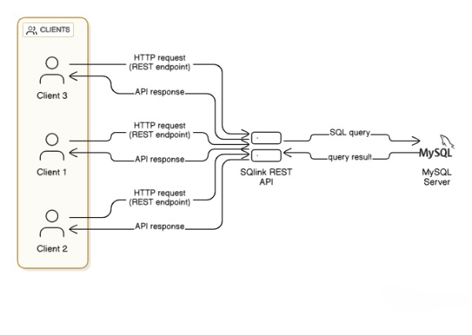

# Introduction

**SQLink** is a free and open-source Node.js library designed to simplify database interactions by providing ready-to-use APIs for MySQL. With SQLink, developers can easily perform essential database operations such as reading data (GET), creating new entries (POST), updating existing records (PUT), and deleting data (DELETE) without having to manually code these functionalities.

## Architecture

The diagram illustrates how multiple clients (such as applications or users) interact with a MySQL database through the SQLink REST API.

- Each client sends an HTTP request to a REST endpoint exposed by the API.
- The API translates the request into an SQL query and forwards it to the MySQL server.
- The MySQL server processes the query and returns the query result.
- Finally, the API sends back an API response to the requesting client.

## Features
Additionally, SQLink offers built-in support for executing stored procedures, allowing you to pass arguments and handle more complex database logic seamlessly.

## Use Cases
This library significantly reduces the time and effort required during the development process, particularly for those who want to focus on front-end development or need to quickly prototype their applications. Whether you're working on a personal project, learning new skills, or building a prototype, SQLink provides a robust solution that accelerates development by handling the backend for you.